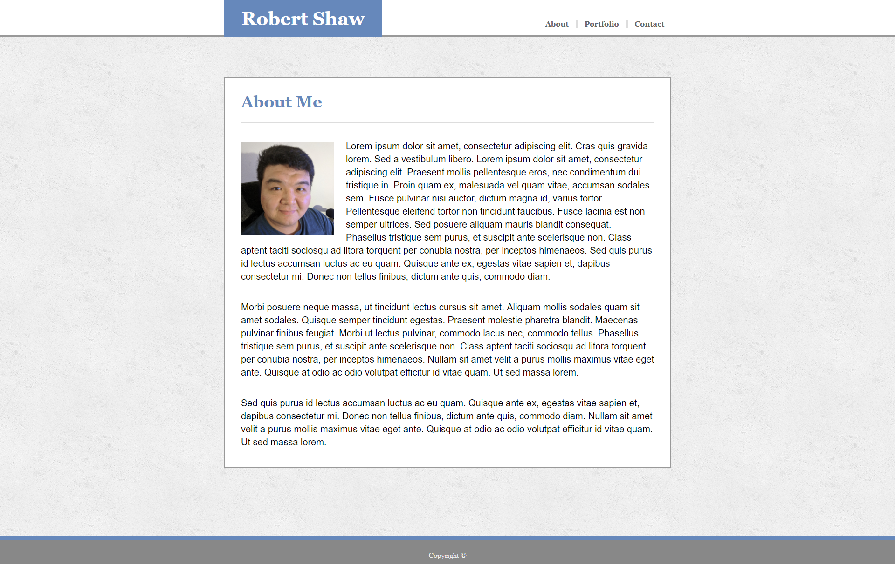

# Responsive Portfolio

A prototype for a portfolio website with additional responsiveness to different screen sizes. The layout changes depending on the screen size viewed at. Most of the elements aren't functional yet, but the layout and planned content are relevant.

## Getting Started

Open up the [project link](https://robertshaw87.github.io/Responsive-Portfolio/) and you should be able to see the example webpage shown below:



### Prerequisites

You need to have a modern browser able to handle html5 and css. 

Some popular browsers are:
```
Google Chrome
Mozilla Firefox
Safari
Opera
Edge
```

### Installing

No installation needed! Just open the page in your preferred browser.

## Built With

* Html

* CSS

* [Basic-Portfolio](https://github.com/robertshaw87/Basic-Portfolio) - An earlier version of this Portfolio layout without responsiveness.

## Authors

* **Robert Shaw** - [robertshaw87](https://github.com/robertshaw87)
